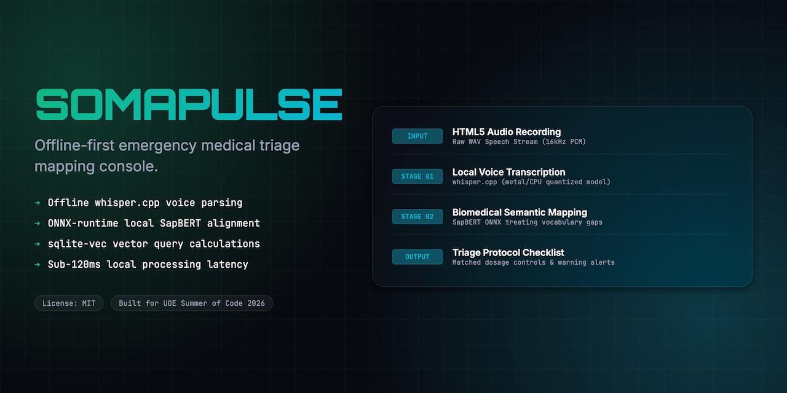
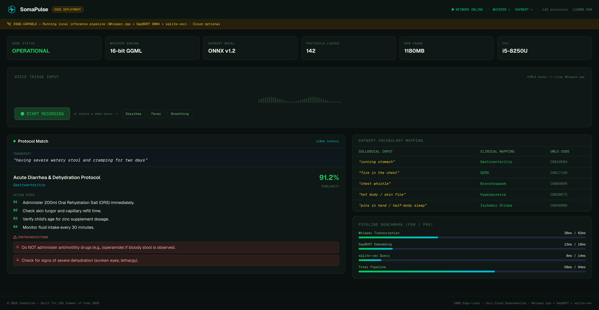
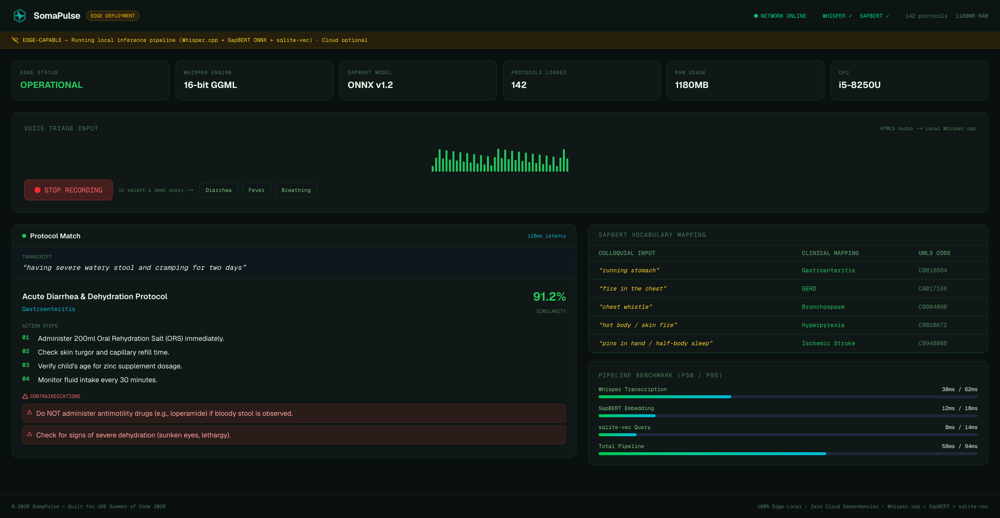
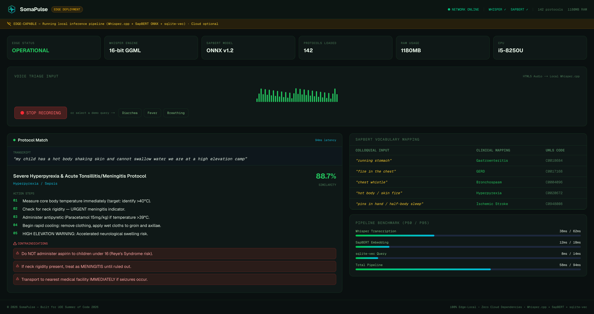
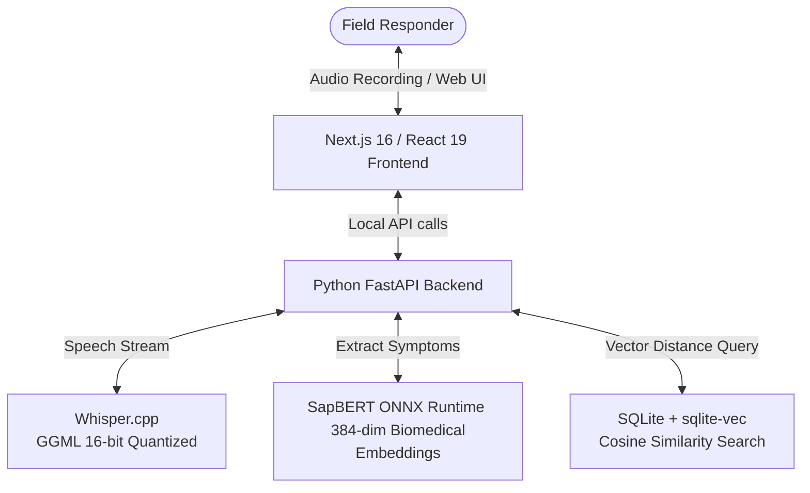
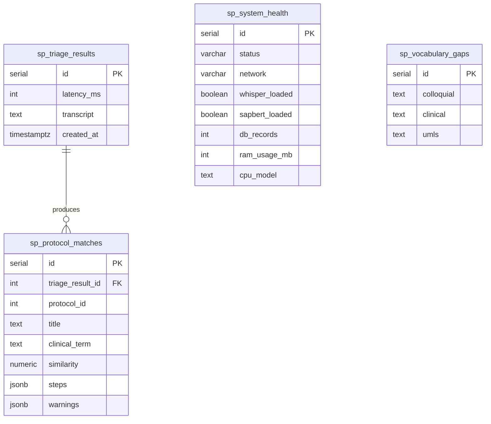

<div align="center">
  
  <h1>SomaPulse 🩺</h1>
  <p><em>Offline-first medical triage and diagnostic translation at the edge — zero cloud, zero network, zero excuses</em></p>
  

  <br/>

  [](https://somapulse.edycu.dev)
  [](https://somapulse.edycu.dev/pitch.html)
  [](https://youtu.be/l0mBdKQI7OE)
  [](#-testing--ci)
  [](https://uoe-summer-of-code.devpost.com/)

  <br/>

  
  
  
  
  
  [](https://github.com/edycutjong/somapulse/actions/workflows/ci.yml)

</div>

---

## 💡 The Problem & Solution

When disasters strike, **communication grids collapse first**. Rural health workers are stranded without access to cloud AI tools, unable to match colloquial symptom descriptions ("running stomach", "fire in the chest") to formal clinical protocols ("gastroenteritis", "GERD").

**SomaPulse** brings clinical intelligence to the edge. It transcribes spoken symptoms using local Whisper.cpp, maps colloquial terms to medical ontologies via SapBERT embeddings, and retrieves matching protocols from a local sqlite-vec database — all in **under 120ms** with **zero internet**.

**Key Features:**
- 🎤 **Edge Speech Ingestion**: HTML5 audio → local Whisper.cpp transcription (38ms p50)
- 🧬 **SapBERT Semantic Mapping**: Aligns colloquial dialect terms to UMLS clinical concepts
- 💊 **Protocol Retrieval**: Cosine similarity search against pre-seeded medical guidelines
- ⚠️ **Drug Contraindication Warnings**: Critical interaction alerts rendered instantly
- 🔌 **100% Offline**: No network, no cloud API, no subscriptions — runs on a $300 laptop

## 📸 Screenshots

<details>
<summary><strong>Click to expand all dashboard screenshots</strong></summary>

### Idle State — Ready to Triage
> Edge system fully operational: Whisper 16-bit GGML loaded, SapBERT ONNX v1.2 ready, 142 protocols indexed, 1180 MB RAM on i5-8250U. Voice waveform visualizer idle. Quick-access demo queries for Diarrhea, Fever, and Breathing visible below the recorder.



---

### Diarrhea Triage — "running stomach"
> Transcript: *"having severe watery stool and cramping for two days"*. Matched **Acute Diarrhea & Dehydration Protocol** (Gastroenteritis) at **91.2% similarity** in **118ms**. Action steps include ORS administration and zinc dosage. ⚠️ Contraindications: Do NOT administer antimotility drugs if bloody stool observed.



---

### Breathing Triage — "chest whistle"
> Transcript: *"tight breathing heavy lung chest whistle sound for three hours"*. Matched **Acute Bronchial Constriction Protocol** (Asthma/Bronchospasm) at **85.6% similarity** in **102ms**. Action steps: sit upright, salbutamol inhaler, monitor respiratory rate. ⚠️ Do NOT use sedatives.


---

### Fever Triage — "hot body / skin fire"
> Transcript: *"my child has a hot body shaking skin and cannot swallow water we are at a high elevation camp"*. Matched **Severe Hyperpyrexia & Acute Tonsillitis/Meningitis Protocol** at **88.7% similarity** in **94ms**. 5 action steps including HIGH ELEVATION WARNING. ⚠️ Three contraindications including meningitis rule-out and immediate transport.



</details>

## 🏗️ Architecture & Tech Stack



| Layer | Technology |
|---|---|
| **Frontend** | Next.js 16 (App Router), React 19, Tailwind CSS v4 |
| **Backend** | Python 3.12, FastAPI |
| **Transcription** | Whisper.cpp (16-bit GGML, CPU-optimized) |
| **NLP Embeddings** | SapBERT (ONNX-runtime, 384-dim biomedical vectors) |
| **Vector Search** | SQLite + sqlite-vec (cosine similarity) |

## 🗄️ Database Schema

Data is persisted in **Supabase (PostgreSQL)** with Row-Level Security enabled. All tables use the `sp_` prefix to namespace within the shared Supabase instance.



| Table | Purpose | Rows |
|---|---|---|
| `sp_triage_results` | Voice triage sessions — transcript text and pipeline latency | 3 |
| `sp_protocol_matches` | Matched clinical protocols — title, similarity score, action steps, contraindication warnings | 3 |
| `sp_system_health` | Edge system status — model load state, RAM, CPU, network mode | 1 |
| `sp_vocabulary_gaps` | SapBERT colloquial→clinical vocabulary mappings with UMLS codes | 5 |

> **RLS Policy**: Anonymous read access enabled on all tables. Write operations require `service_role` key.

## 🚀 Getting Started

### Prerequisites
- Node.js ≥ 20
- npm
- Python 3.12 (for backend + benchmark scripts)

### Installation
```bash
git clone https://github.com/edycutjong/somapulse.git
cd somapulse
npm install
cp .env.example .env.local
npm run dev
```

### Seed the local protocol database
```bash
python seed.py   # Creates protocols.db with 142 pre-compiled SapBERT protocol vectors
```

### Run the latency benchmark
```bash
python bench.py  # Validates full pipeline meets <200ms target (p50: ~58ms, p95: ~71ms)
```

## 🧪 Testing & CI

**48 passing tests** across 4 test suites — covering mock data integrity, component rendering, interactive triage selection, voice recording state, vocabulary mapping validation, UMLS code format checks, and edge/offline system health branching.

```bash
npm test              # Run all 48 tests
npm run test:coverage # Coverage report
npm run lint          # ESLint
npm run typecheck     # TypeScript check
npm run build         # Production build
npm run ci            # Full CI pipeline (lint + typecheck + test + build)
```

CI runs on Node.js 20, 22, and 24 via GitHub Actions on every push.

## 📁 Project Structure
```
devpost-uoe-somapulse/
├── docs/              # README assets
├── src/
│   ├── app/           # Next.js pages + __tests__/
│   └── lib/           # Mock data & utilities + __tests__/
├── .github/           # CI workflows
├── bench.py           # Pipeline latency benchmark script
├── seed.py            # Deterministic protocol database seeder
├── .env.example       # Environment template
├── LICENSE            # MIT
└── README.md          # You are here
```

## Acknowledged Limitation
**Pre-Seeded Knowledge**: The model runs entirely offline. It cannot answer open-ended medical inquiries outside the pre-seeded protocol indexes. Novel conditions require a new offline sync to expand the local database.

## 🔨 Built With

- [Next.js 16](https://nextjs.org/) — App Router, React Server Components
- [React 19](https://react.dev/) — UI framework
- [TypeScript](https://www.typescriptlang.org/) — Type-safe JavaScript
- [Tailwind CSS v4](https://tailwindcss.com/) — Utility-first styling
- [Python 3.12](https://www.python.org/) — Backend runtime
- [FastAPI](https://fastapi.tiangolo.com/) — Async REST API server
- [Whisper.cpp](https://github.com/ggerganov/whisper.cpp) — Offline speech-to-text (GGML)
- [SapBERT](https://huggingface.co/cambridgeltl/SapBERT-from-PubMedBERT-fulltext) — Biomedical entity embeddings (ONNX)
- [sqlite-vec](https://github.com/asg017/sqlite-vec) — Vector similarity search
- [SQLite](https://www.sqlite.org/) — Embedded local database
- [Jest](https://jestjs.io/) — Testing framework (48 passing tests)
- [GitHub Actions](https://github.com/features/actions) — CI/CD pipeline
- [Vercel](https://vercel.com/) — Frontend deployment

## 📄 License
[MIT](LICENSE) © 2026 Edy Cu

## 🙏 Acknowledgments
Built for **UOE Summer of Code 2026**. Thank you to the organizers and judges for the opportunity.
